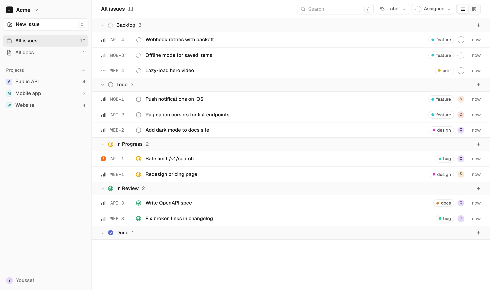
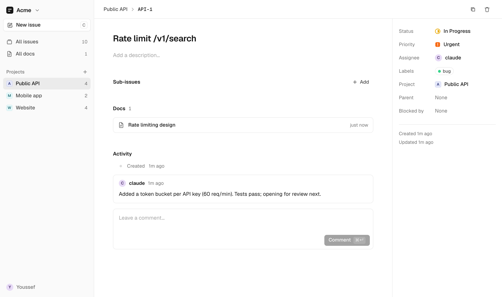
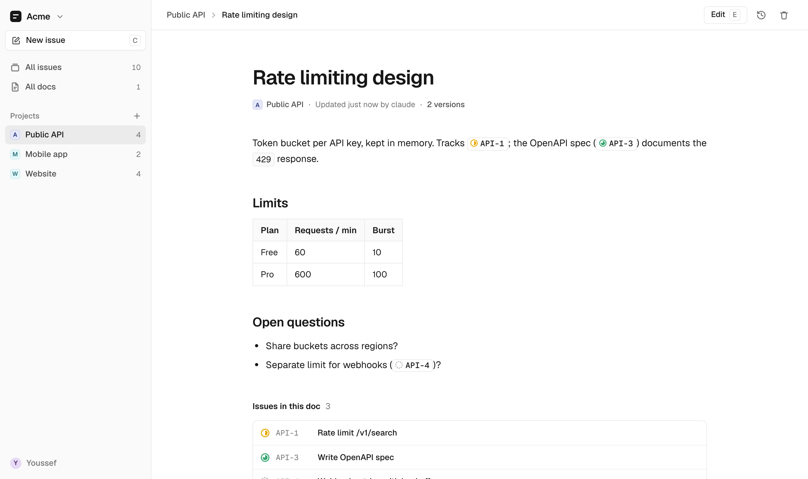

<div align="center">


# Docket

**The issue tracker your AI agents can actually use.**

Issues, boards and docs, with a clean web UI for you and an MCP server for Claude and other agents. Same tracker, both at the same time, live.

One container. One SQLite file. Your people and your agents, each with their own sign-in. No SaaS.

[](LICENSE)
[](https://bun.sh)
[](https://modelcontextprotocol.io)
[](CONTRIBUTING.md)



</div>

## Why Docket

Agents are good at doing work and bad at keeping track of it. Docket gives them a place to do that: they pick up issues, post progress, write the spec and move things to review, while you watch it happen in the browser.

- **Built for agents and humans together.** 22 MCP tools for issues, comments and docs. Every agent gets its own token and name, and claims issues as a delegate, the way Linear's agents do. What an agent does shows up in your UI right away over WebSocket.
- **Linear's model, tiny code.** Workspaces with members and admins, teams, list and board views, priorities, labels, sub-issues, blockers, keyboard shortcuts (`C`, `/`, `⌘↵`).
- **Docs next to your issues.** Markdown docs with version history. Write `API-1` and it links to the issue, with its status shown inline.
- **Yours.** Self-hosted, a single SQLite file, five runtime dependencies. Back it up live with `./backup.sh`.
- **Works everywhere.** Install it as a PWA on iPhone, iPad or Mac. It works offline for the issues and docs you've already opened.

<table>
  <tr>
    <td></td>
    <td></td>
  </tr>
</table>

## Quick start

```sh
git clone https://github.com/youssefaltai/docket && cd docket
mkdir -p data && sudo chown -R 1000:1000 data
docker compose up -d --build
```

Open http://localhost:7100. Your data lives in `./data`, a single SQLite file. Don't `cp` it while Docket is running — WAL mode makes that unsafe. Use `./backup.sh` instead: it takes a consistent snapshot with `VACUUM INTO`, safe to run live.

The `chown` matches `./data` to the container's non-root user (`bun`, uid 1000), which owns it inside the image. Already running Docket without it? Same command, run once, fixes an existing deployment too.

The first time it starts, Docket prints a one-time setup code (`docker compose logs docket`). Enter it at http://localhost:7100/setup to create your account; you become the admin of your first workspace.

Then give Claude Code its own token: **Settings → Workspace → Add agent** shows a ready-to-paste command:

```sh
claude mcp add --transport http --scope user docket http://localhost:7100/mcp \
  --header "Authorization: Bearer dk_…"
```

Try: *"Create a team called Website in Docket and file issues for everything in TODO.md."*

## Going further

<details>
<summary><b>Put it on a server</b></summary>

The container listens on `127.0.0.1:7100` only. Put it behind whatever you already use for HTTPS: a reverse proxy (Caddy, nginx, Traefik), a tunnel, or a private network like Tailscale or WireGuard.

Back up with `./backup.sh`. Run it from a nightly cron: it writes a consistent snapshot into `data/backups/` and keeps 14 days.

</details>

<details>
<summary><b>Upgrade</b></summary>

```sh
./backup.sh
git pull
docker compose up -d --build
```

Schema changes apply by themselves on startup and never drop data. Keep the backup until you know the new version works: it is your way back.

</details>

<details>
<summary><b>People, agents and sign-in</b></summary>

Docket copies Linear's model: everyone signs in, each workspace has its own members, and agents are apps with their own tokens.

- **People** join with an invite link (**Settings → Workspace → Invite**): whoever opens it creates an account, or joins with the one they're signed in to. There are no passwords and no email: to sign in on a new device, open **Settings → Account → Sign in on another device** on one where you're signed in, or ask an admin for a sign-in link. Links work once and expire after 15 minutes.
- **Agents** are added by an admin (**Settings → Workspace → Add agent**) and get a token, shown once. They write under their own name, and claiming an issue makes them its delegate while a person stays the assignee.
- **Scripts** use personal API keys (**Settings → Account → API keys**), read-only or read-write. Keys can't create other keys, invites or sign-in links: that takes the web app.
- **Removing someone** is suspending them: their access ends at once and their history keeps their name.

Serve it over HTTPS anywhere but localhost.

**Locked out?** On the server, `docker compose exec docket bun run sign-in-link <username>` prints a one-time sign-in link. Set `DOCKET_URL` so it points at your public address.

</details>

<details>
<summary><b>Configuration</b></summary>

| Variable | Default |
|---|---|
| `PORT` | `7100` |
| `DATABASE_PATH` | `$XDG_DATA_HOME/docket/docket.db` |
| `DOCKET_SETUP_CODE` | random, printed at startup while there are no users; set it to fix the code (tests, automation) |
| `DOCKET_URL` | `http://localhost:$PORT`; the public address `sign-in-link` puts in links |
| `DOCKET_HOSTS` | unset — extra hostnames (comma-separated) allowed in the `Host` header, besides `localhost`, e.g. `docket.example.com,vps.tailnet.ts.net`. Needed when serving over Tailscale or another hostname. |

In Docker, set these in a `.env` file next to `docker-compose.yml` (see `.env.example`). `PORT` there only changes the host-side port mapping; the container always listens on `7100` internally.

You can also use an optional config file at `$XDG_CONFIG_HOME/docket/config` or `$XDG_CONFIG_DIRS/docket/config`, with `KEY=VALUE` lines (`#` starts a comment line; an unquoted value drops a trailing ` # comment`; surrounding quotes are stripped). Real env vars win over the file, unless a var is set but empty — e.g. docker-compose's `${DOCKET_HOSTS:-}` — which counts as unset.

</details>

<details>
<summary><b>MCP tools</b></summary>

`list_workspaces`, `create_workspace`, `update_workspace`, `list_members`, `list_teams`, `create_team`, `update_team`, `list_issues`, `list_labels`, `get_issue`, `create_issue`, `update_issue`, `claim_issue`, `comment_issue`, `list_documents`, `get_document`, `create_document`, `update_document`, `comment_document`, `delete_document`, `update_comment`, `delete_comment`.

The full REST API and data model are in [SPEC.md](SPEC.md).

</details>

## Contributing

Contributions are welcome, from typo fixes to new features. Docket is small on purpose, so you can read the whole codebase in an afternoon.

```sh
bun install
bun run dev   # http://localhost:7100, hot reload, data in ./dev.db, setup code DEVEL-SETUP
bun test
```

See [CONTRIBUTING.md](CONTRIBUTING.md) for how the code is laid out and what makes a PR easy to merge. Not sure where to start? [Open an issue](https://github.com/youssefaltai/docket/issues/new) and say hi.

## License

[MIT](LICENSE)
