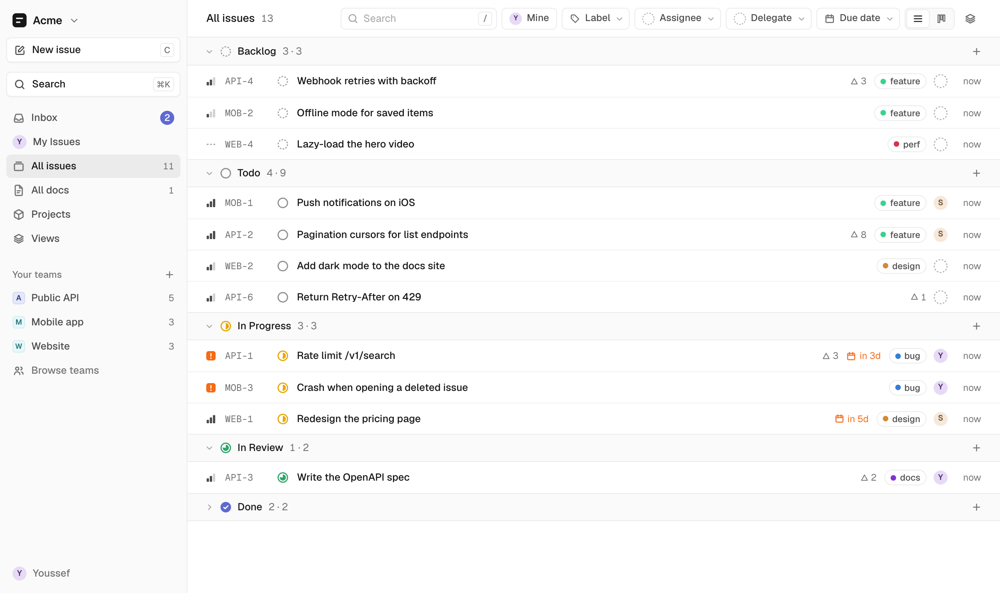
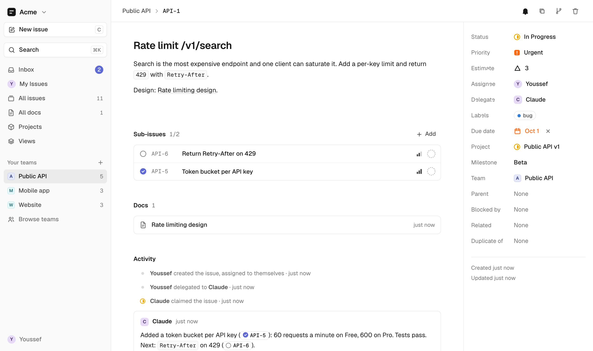
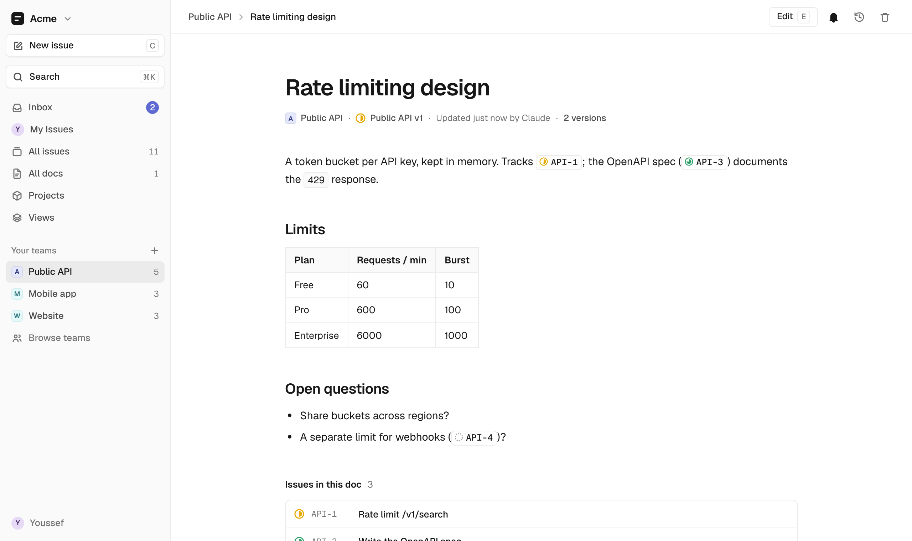
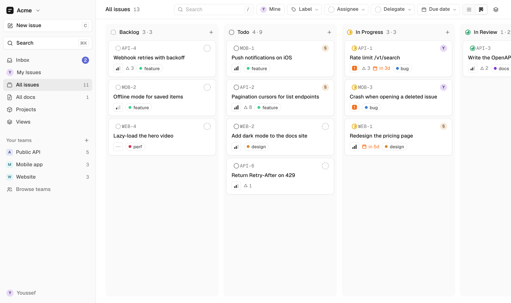
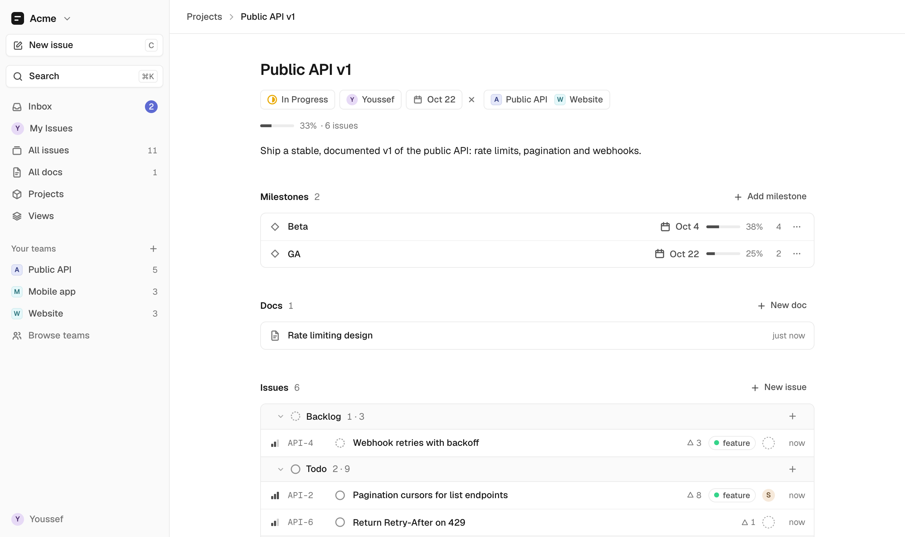

<div align="center">


# Docket

**The issue tracker your AI agents can actually use.**

Issues, boards and docs, with a web UI for people and an MCP server for Claude and other agents. Self-hosted: one container, one SQLite file.

[](LICENSE)
[](https://bun.sh)



</div>

## Features

- **For agents and people together.** 35 MCP tools for issues, projects, comments, docs, notifications and files. Every agent has its own name and token, and claims issues as a delegate, the way Linear's agents do. What an agent does shows up in the UI live, over WebSocket, and in the issue's history.
- **Modeled on Linear.** Workspaces with admins, members and guests; public and private teams with their own workflows; projects with milestones; cycles; estimates; saved list and board views; an inbox with @mentions and push notifications (the iPhone Home Screen app too); a command menu (`⌘K` / `Ctrl+K`) and keyboard shortcuts.
- **Docs next to issues.** Rich-text docs stored as Markdown, with version history. Write `API-1` and it links to the issue, with its status icon.
- **Connected.** GitHub pull requests and commits move issues along; signed webhooks tell your own services what changed.
- **Installable.** A PWA, with a service worker that keeps what you've opened readable offline.

<table>
  <tr>
    <td></td>
    <td></td>
  </tr>
  <tr>
    <td></td>
    <td></td>
  </tr>
</table>

## Quick start

```sh
git clone https://github.com/youssefaltai/docket && cd docket
mkdir -p data && sudo chown -R 1000:1000 data
docker compose up -d --build
```

Open http://localhost:7100. `chown` gives `./data` to the container's non-root user (`bun`, uid 1000); run it once on an existing install too.

On first start Docket prints a one-time setup code (`docker compose logs docket`). Enter it at http://localhost:7100/setup to create your account; you become admin of your first workspace.

Then give Claude Code its own token: **Settings → Workspace → Add agent** shows a ready-to-paste command:

```sh
claude mcp add --transport http docket-<workspace> http://localhost:7100/mcp \
  --header "Authorization: Bearer dk_…"
```

Run it in your project folder. Each workspace is its own server (`docket-acme`, `docket-side`), so they never clash.

## Data and backups

`./data` holds `docket.db` (SQLite, WAL mode) and `attachments/` (uploaded files). Don't `cp` them while Docket runs; use `./backup.sh`.

`./backup.sh` runs `VACUUM INTO` inside the container, safe while Docket is live. It writes `data/backups/docket-YYYY-MM-DD.db`, deletes snapshots older than 14 days, and copies new uploads into `data/backups/attachments/` (never pruned: snapshots link to them). Run it nightly from cron (there's an example line in the script) and copy `data/backups/` off the server.

To restore, stop Docket, then put a snapshot back as `data/docket.db` and `data/backups/attachments/` as `data/attachments/`.

## Going further

<details>
<summary><b>Put it on a server</b></summary>

`docker-compose.yml` publishes the port on `127.0.0.1` only. Put HTTPS in front with whatever you already use: a reverse proxy (Caddy, nginx, Traefik), a tunnel, or a private network like Tailscale or WireGuard. Add the hostname to `DOCKET_HOSTS`, or data routes answer 403.

Give each Docket its own hostname: browsers share cookies across ports, so two Dockets on `localhost:7100` and `localhost:7200` sign each other out.

</details>

<details>
<summary><b>Upgrade</b></summary>

```sh
./backup.sh
git pull
docker compose up -d --build
```

Schema changes apply on startup. Keep the backup until you know the new version works.

</details>

<details>
<summary><b>People, agents and sign-in</b></summary>

- **People** join with an invite link (**Settings → Workspace → Invite**): whoever opens it creates an account, or joins with the one they're signed in to. There are no passwords: to sign in on a new device, open **Settings → Account → Sign in on another device** on one where you're signed in. Invite and sign-in links work once and expire after 15 minutes.
- **Agents** are added by an admin (**Settings → Workspace → Add agent**) and get a token, shown once. They write under their own name; claiming an issue makes an agent its delegate while a person stays the assignee.
- **Scripts** use personal API keys (**Settings → Account → API keys**), read-only or read-write. A key works only in the workspace it was made in. It can't create keys, workspaces, invites or sign-in links: that takes a browser session.
- **Removing someone** suspends them: their access to the workspace and their API keys there end at once, and their history keeps their name. If it was their only workspace, their sessions are deleted too.

**Locked out?** On the server, `docker compose exec docket bun run sign-in-link <username> [workspace]` prints a one-time sign-in link. Usernames are per workspace: name the workspace if several people hold the username. Set `DOCKET_URL` so the link uses your public address.

</details>

<details>
<summary><b>Connect GitHub</b></summary>

Pull requests and commits link to the issues they mention: a branch like `ana/dkt-12-fix-login` (copy it from the issue page, or press `⌘/Ctrl+Shift+.` there), the identifier in the PR title, or `Fixes DKT-12` in its title or description. Opening a PR moves the issue to In Review (a draft PR: to the team's first started status), and merging it to Done. `Part of DKT-12` links without moving it.

An admin connects it in **Settings → Workspace → GitHub** and gets a payload URL and a secret, shown once. Add them as a webhook in the GitHub repo or organization (**Settings → Webhooks → Add webhook**): content type `application/json`, events Pull requests and Pushes. GitHub must be able to reach that URL, and its host must be in `DOCKET_HOSTS`.

</details>

<details>
<summary><b>Configuration</b></summary>

| Variable | Default |
|---|---|
| `PORT` | `7100` |
| `DATABASE_PATH` | `$XDG_DATA_HOME/docket/docket.db` (`~/.local/share` if unset); `/app/data/docket.db` in Docker |
| `DOCKET_SETUP_CODE` | random, printed at startup while there are no users; set it to fix the code |
| `DOCKET_URL` | unset. The public address: used in `sign-in-link` links (default `http://localhost:$PORT`), the setup-code line and, when `https`, as the contact push services see |
| `DOCKET_HOSTS` | unset. Extra hostnames (comma-separated) allowed in the `Host` header, besides `localhost`, `127.0.0.1` and `[::1]`, e.g. `docket.example.com,vps.tailnet.ts.net` |
| `DOCKET_WEBHOOK_ALLOW_PRIVATE` | unset. `true` lets webhooks target private, loopback and link-local addresses and plain `http`; otherwise only public `https`. Set it only if every workspace admin may reach this server's network. |

In Docker, set `DOCKET_HOSTS`, `DOCKET_URL` and `DOCKET_WEBHOOK_ALLOW_PRIVATE` in a `.env` file next to `docker-compose.yml` (see `.env.example`); any other variable goes under `environment:` in `docker-compose.yml`. There `PORT` only changes the host-side port; the container always listens on `7100`.

</details>

<details>
<summary><b>MCP tools</b></summary>

- **Workspace and teams:** `update_workspace`, `list_members`, `list_teams`, `create_team`, `update_team`, `list_labels`, `list_cycles`, `list_templates`
- **Issues:** `list_issues`, `get_issue`, `create_issue`, `update_issue`, `claim_issue`, `comment_issue`, `react`, `subscribe`
- **Projects:** `list_projects`, `get_project`, `create_project`, `update_project`, `create_milestone`, `update_milestone`
- **Docs:** `list_documents`, `get_document`, `create_document`, `update_document`, `comment_document`, `delete_document`
- **Comments:** `update_comment`, `delete_comment`, `resolve_thread`
- **Inbox and files:** `list_notifications`, `mark_notifications_read`, `attach_file`, `get_attachment`

A key acts in one workspace and sees only the tools it can use: read-only keys get the 13 `list_*` and `get_*` tools; `create_team` and `update_team` are for people, `update_workspace` for admins.

The REST API and data model are in [SPEC.md](SPEC.md).

</details>

## Contributing

See [CONTRIBUTING.md](CONTRIBUTING.md). Not sure where to start? [Open an issue](https://github.com/youssefaltai/docket/issues/new).

## License

[MIT](LICENSE)
